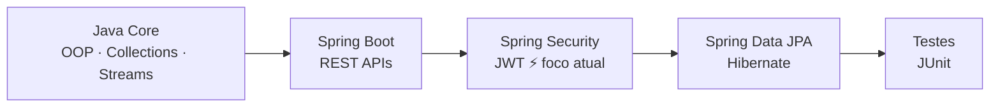

  

 

## 🧭 Sobre mim

Estudante de **Engenharia de Software na UNIPÊ** (João Pessoa - PB, previsão 2029), migrando de uma base sólida em **React/TypeScript/Node.js** para uma especialização em **desenvolvimento Backend com Java e Spring Boot**.

- 🔭 Atualmente construindo SaaS reais: **Marquify** (agendamento) e **MenuQr** (cardápios + assinaturas)
- 🌱 Aprofundando em Spring Security, JWT, JPA/Hibernate e PostgreSQL
- 🎯 Buscando oportunidades de **estágio em desenvolvimento Backend** no Brasil
- ⚙️ Fluxo de trabalho: IntelliJ IDEA + VS Code, Git/GitHub, PowerShell
- 💬 Aprendo melhor colocando a mão no código — todo projeto abaixo foi construído e debugado do zero

 

## 🛠️ Tech Stack

<table>
<tr>
<td valign="top" width="50%">

**Backend**

</td>
<td valign="top" width="50%">

**Frontend & Serverless**

</td>
</tr>
<tr>
<td valign="top">

**Ferramentas**

</td>
<td valign="top">

**Deploy & Integrações**

</td>
</tr>
</table>

 

## 🚀 Projetos em Destaque

### 📅 Marquify
Plataforma SaaS full-stack de agendamento para pequenos negócios locais (salões, barbearias, clínicas), com confirmação via WhatsApp.
`Spring Boot` `Spring Security + JWT` `PostgreSQL` `React/Vite` `Axios interceptors`

### 🍽️ MenuQr
Plataforma SaaS para restaurantes com assinaturas recorrentes via Mercado Pago (fluxo preapproval) e validação de webhooks.
`Spring Boot` `Mercado Pago API` `Webhooks` `ngrok`

### 🔗 EncurtadorDeLinks-API
Encurtador de URLs com backend em Spring Boot e frontend em React/Vite.
`Spring Boot` `React` `REST API`

### 🔮 Descubra seu Stand
Projeto full-stack temático de JoJo's Bizarre Adventure que mapeia data de nascimento a arcanos do tarot e Stands.
`Spring Boot` `React` `Deploy: Render + Vercel`

### 📆 Agenda Digital
App de agendas compartilhadas com sincronização em tempo real e notificações push.
`React` `Supabase Realtime` `Web Push` `RLS`

### 🌌 Portfólio Pessoal
Site pessoal com tema espacial, terminal animado e formulário de contato integrado.
`React` `TypeScript` `Vite` `Supabase + Resend`

 

## 🗺️ Trilha de Aprendizado Atual

 

### 💬 Vamos conversar?

Aberto a oportunidades de **estágio em desenvolvimento Backend**. Se você curte Java, Spring Boot ou só quer trocar uma ideia sobre código, me chama!

 

psst, você chegou até aqui... 👀
 

