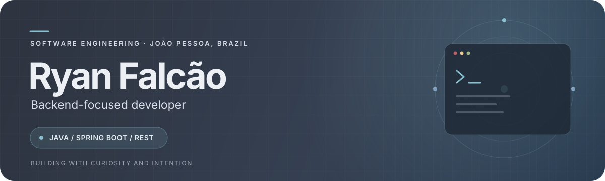
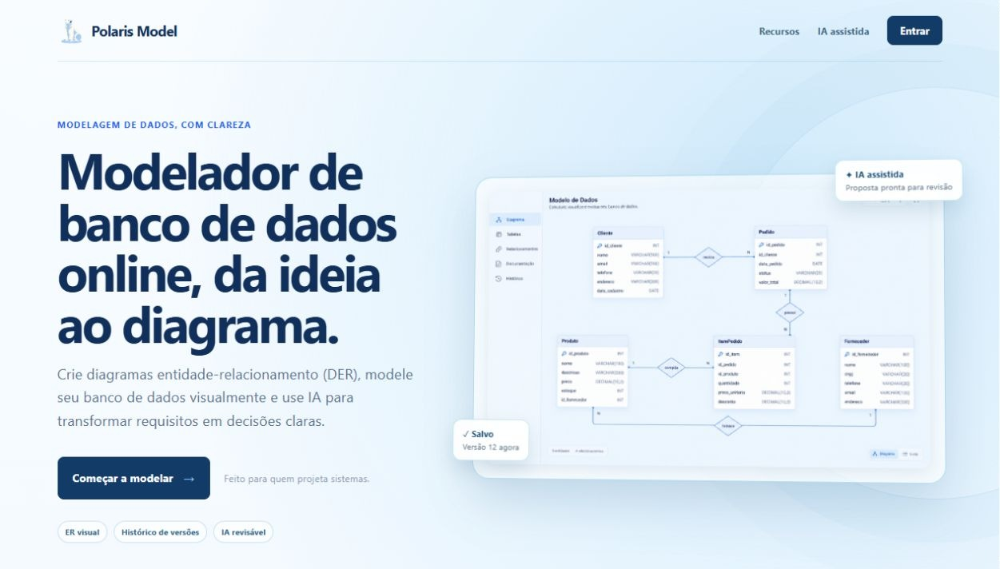
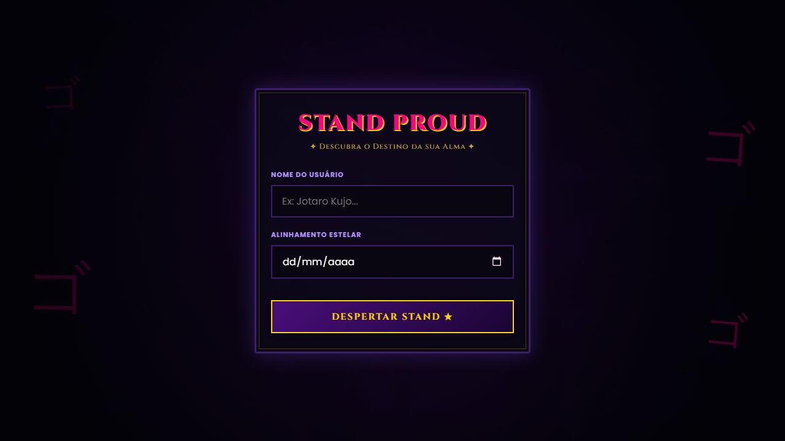

 

**Software Engineering Student · Backend & Full Stack Developer**

[Portfolio](https://ryan-falcao-portfolio.vercel.app) &nbsp;·&nbsp; [GitHub](https://github.com/Ryan-Falcao) &nbsp;·&nbsp; [LinkedIn](https://www.linkedin.com/in/ryan-falcao)

 

## About

I’m a Software Engineering student at **UNIPÊ**, based in João Pessoa, Brazil, with an expected graduation in 2029. My main focus is building backend applications with **Java and Spring Boot**—from REST APIs and authentication to data persistence. I also build full-stack projects with React and work with Python and Django. I’m especially interested in software architecture, secure applications, and thoughtful uses of AI.

## Toolkit

**Backend**  
 Java &nbsp;  Spring Boot &nbsp;  Spring Security &nbsp;  Python &nbsp;  Django

**Frontend**  
 React &nbsp;  TypeScript &nbsp;  JavaScript

**Data**  
 PostgreSQL &nbsp;  MySQL &nbsp; SQL

**Tools & concepts**  
 Docker &nbsp;  Git & GitHub &nbsp; JWT · OAuth · REST APIs · C

## Selected work

<table>
  <tr>
    <td width="33%" valign="top">
      
      <h3><a href="https://polaris-model.vercel.app/">Polaris Model ↗</a></h3>
      
An entity-relationship modeling tool exploring AI-assisted workflows for data design.

      Django · Django REST Framework · React · AI integrations
    </td>
    <td width="33%" valign="top">
      
      <h3><a href="https://descubra-seu-stand-frontend.vercel.app/">Descubra seu Stand ↗</a></h3>
      
A full-stack experience: a React interface calls a Java API to return a personalized result from a birth date.

      Java · Spring Boot · REST API · React
    </td>
    <td width="33%" valign="top">
      
      <h3><a href="https://curtalink.vercel.app/">CurtaLink ↗</a></h3>
      
A focused URL shortener that turns long addresses into compact links ready to share.

      Java · Spring Boot · Spring Data JPA · MySQL · React
    </td>
  </tr>
</table>

<a href="https://github.com/Ryan-Falcao?tab=repositories">Browse my repositories on GitHub ↗</a>

## What I’m building toward

I’m looking for an opportunity to contribute to a software team, deepen my backend engineering practice, and keep growing through real product work. I care about understanding the decisions behind a system—not just getting it to run.

## Let’s connect

[LinkedIn](https://www.linkedin.com/in/ryan-falcao) &nbsp;·&nbsp; [GitHub](https://github.com/Ryan-Falcao) &nbsp;·&nbsp; [Portfolio](https://ryan-falcao-portfolio.vercel.app)

 

Nord-inspired · Clear interfaces, dependable systems, continuous learning.

